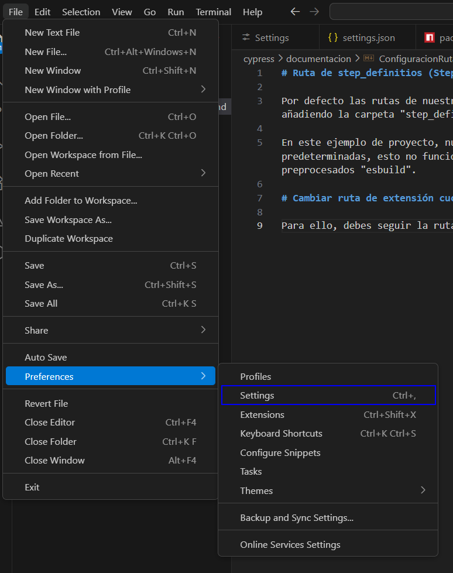
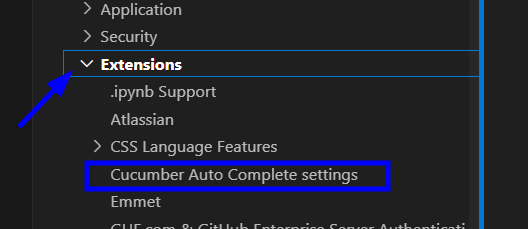
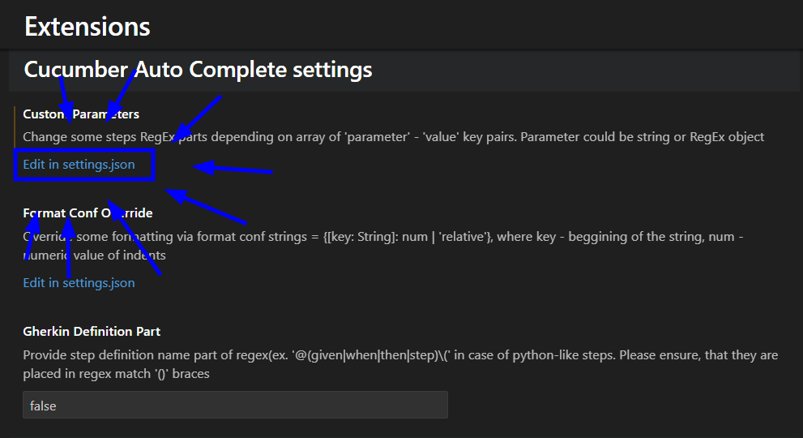

# Ruta de step_definitios (Steps)

Por defecto las rutas de nuestros steps se encuentran en "cypress/support/", desde aquí se crea la ruta directa a nuestro step añadiendo la carpeta "step_definitions".

En este ejemplo de proyecto, nuestros steps se encuentran dentro de la carpeta "e2e", pero si no se modifican las rutas predeterminadas, esto no funcionará nunca. Para ello debemos cambiar las rutas de nuestra extersion de "Cucumber" y de nuestro preprocesados "esbuild".

## Cambiar ruta de extensión cucumber

Para ello, debes seguir la ruta "Files > Preferences > Settings"



Desde aquí debemos abrir nuestras extensiones y pulsar sobre la configuracion auto-completada (por defecto) de cucumber



Luego desde esta debemos presionar la edición de json de cucumber



Desde este archivo debemos agregar la ruta que queremos (en caso de que esta ya se encuentre, se debe cambiar solo en enrutado), tener presente que el comando debe ser el mismo.

```json
    "cucumberautocomplete.steps": [
        "cypress/e2e/steps/*.js"
    ],
```

**NOTA SUPER HIPER MEGA IMPORTANTE:** si se ve la ruta NO cuenta con la validación de carpetas adicionales dentro de la carpeta "steps", es decir, si vemos la estructura de nuestro proyecto, dentro de nuestra carpeta steps tenermos carpetas divisoras como "estructuracionFinanciera", las cuales son las que contienen nuestros steps, estas carpetas NO se especifican en la ruta. Ejemplo:

+ **MALO** -> "cypress/e2e/steps/**/*.js"

+ **BUENO** -> "cypress/e2e/steps/*.js"

---

## Cambiar ruta de preprocesador

Una vez cambiada la ruta de nuestro cucumber, debemos indicarle a nuestro preprocesador (un preprocesador es el traductor de cucumber para los framework) cual es la ruta que contiene nuestros steps, para ellos debe ir a nuestro package.json y especificar esta:


```json
  "cypress-cucumber-preprocessor": {
    "stepDefinitions": "cypress/e2e/steps/**/*.js"
  }
```

**NOTA SUPER HIPER MEGA IMPORTANTE:** a diferencia de nuestra extesión cucumber en esta si debemos especificar las carpetas que contengas nuestros steps. Ejemplo:

+ **BUENO** -> "cypress/e2e/steps/**/*.js"

+ **MALO** -> "cypress/e2e/steps/*.js"
