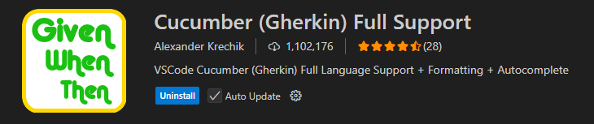
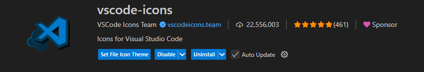

+ **NOTA:** Antes de revisar este proyecto, se debe estudiar y entender el primer proyecto https://github.com/mododiabloBB/Pruebas_Cypress.git.

# Documentación de uso BDD y Cypress

## I. ¿Que es BDD (Behavior Driven Development) y porque??

BDD es una **metodología de desarrollo** enfocada en **describir el comportamiento esperado del sistema** desde la perspectiva del **usuario o negocio, NO del código técnico**.

En vez de decir “voy a probar el botón de login”, dices “el usuario debería poder iniciar sesión exitosamente”.

### Cómo se ve en la práctica

BDD usa una sintaxis llamada Gherkin, que sigue el formato:

```gherkin
Feature: Inicio de sesión
  Como usuario registrado
  Quiero poder iniciar sesión en la plataforma
  Para acceder a mi cuenta

  Scenario: Inicio de sesión exitoso
    Given que el usuario está en la página de inicio de sesión
    When ingresa credenciales válidas
    Then debería ver el panel principal
```
Es decir:

+ **Given** → contexto inicial (estado del sistema)

+ **When** → acción del usuario

+ **Then** → resultado esperado

Algo SUPER importante, es que cuando tenemos muchas acciones para realizar, estas se concatenan con un "AND". Pro ejemplo:

```gherkin
Scenario: Creación exitosa de un producto
    Given El usaurio ha iniciado sesion en el sistema correctamente  
    When El usuario navega a la página de productos
    And El usuario hace clic en "Crear productos"
    And El usuario completa el formulario de creación de producto con datos válidos
        | Código    | PRO-AUT        |
        | Nombre    | Producto BDD   |
        | Valor     | 100.000        |
    And El usuario envía el formulario
    Then El sistema muestra una aletar de éxito "El registro fue creados exitosamente"
```

## II. Instalar dependencias necesarias

Desde nuestra terminar debemos ejecutar la linea

```bash
npm install @badeball/cypress-cucumber-preprocessor @bahmutov/cypress-esbuild-preprocessor --save-dev
```
Solo con instalar la primera parte "@badeball/cypress-cucumber-preprocessor", nuestro BDD debería instalar, pero al incluir "@bahmutov/cypress-esbuild-preprocessor" hacemos que el procesamiento de los features sea con ESBuild (más rápido y moderno que webpack).

## III. Configurar nuestro cypress.config

+ **Nota:** Por favor revisar el archivo config para saber un poco mas de las cosas que se estan usando y porque son importantes.

```javascript
const { defineConfig } = require("cypress");
const createBundler = require("@bahmutov/cypress-esbuild-preprocessor");
const addCucumberPreprocessorPlugin = require("@badeball/cypress-cucumber-preprocessor").addCucumberPreprocessorPlugin;
const { createEsbuildPlugin } = require("@badeball/cypress-cucumber-preprocessor/esbuild");

module.exports = defineConfig({
  e2e: {
    baseUrl: "https://site2.q10.com",
    specPattern: "cypress/e2e/features/**/*.feature",
    async setupNodeEvents(on, config) {
      await addCucumberPreprocessorPlugin(on, config);
      on("file:preprocessor", createBundler({
        plugins: [createEsbuildPlugin(config)],
      }));
      return config;
    },
  },
});


```

Algo muy importante para que el gherkin se vea con colores y se estructure de mejor forma, es descargar las extensiones de este, para ello se pueden descargar las siguientes extensiones:

                                                    
